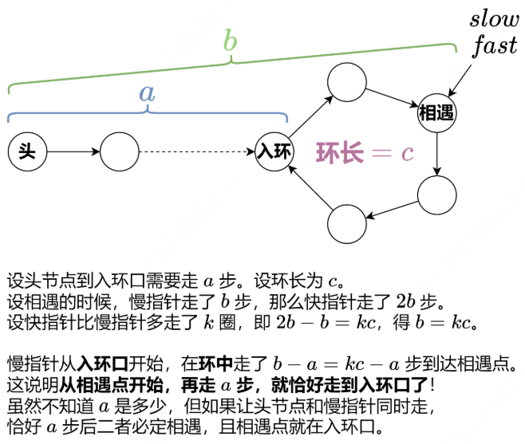

**递归的天然优势** ：链表结构非常适合递归处理，因为每个节点都可以看作一个子问题的起点

### Hot100-[160. 相交链表](https://leetcode.cn/problems/intersection-of-two-linked-lists/)

具体算法如下：

初始化两个指针 p=headA, q=headB。
不断循环，直到 p=q。
每次循环，p 和 q 各向后走一步。具体来说，如果 p 不是空节点，那么更新 p 为 p.next，否则更新 p 为 headB；如果 q 不是空节点，那么更新 q 为 q.next，否则更新 q 为 headA。
循环结束时，如果两条链表相交，那么此时 p 和 q 都在相交的起始节点处，返回 p；如果两条链表不相交，那么 p 和 q 都走到空节点，所以也可以返回 p，即空节点。

```python
classSolution:  
	defgetIntersectionNode(self, headA: ListNode, headB: ListNode) -> Optional[ListNode]:  
		p,q=headA,headB  
		while p isnot q:
			p=p.next if p else headB  
			q=q.next if q else headA  
		return p
```

### Hot100-[206. 反转链表](https://leetcode.cn/problems/reverse-linked-list/)

**简单理解** ：比如链表为 **1**→**2**→**3**。创建一个新的空链表，然后用**头插法**依次把节点 **1**,**2**,**3** 插到这个新链表的头部，就得到了链表 **3**→**2**→**1**，这正是反转后的链表。

```python
# Definition for singly-linked list.
# class ListNode:
#     def __init__(self, val=0, next=None):
#         self.val = val
#         self.next = next
class Solution:
    def reverseList(self, head: Optional[ListNode]) -> Optional[ListNode]:
	pre=None
	cur=head
	while cur:
		nxt=cur.next
		cur.next=pre
		pre=cur
		cur=nxt
	return pre
```

代码功能

这是一个经典的链表反转算法，使用迭代的方式将单链表反转。

变量说明

* `pre`: 用于存储当前节点的前一个节点，初始为 `None`
* `cur`: 当前正在处理的节点，初始为链表头 `head`
* `nxt`: 临时存储当前节点的下一个节点

算法步骤

1. 初始化 `pre`为 `None`，`cur`为链表头 `head`
2. 进入循环，条件是当前节点 `cur`不为空
3. 在循环中：
   * 先保存当前节点的下一个节点到 `nxt`（因为后面要修改 `cur.next`）
   * 将当前节点的 `next`指针指向前一个节点 `pre`（反转操作）
   * 将 `pre`移动到当前节点 `cur`
   * 将 `cur`移动到之前保存的下一个节点 `nxt`
4. 当 `cur`为 `None`时，循环结束，此时 `pre`就是新链表的头节点

### Hot100-[234. 回文链表](https://leetcode.cn/problems/palindrome-linked-list/)

#### **面试实现简单代码**

时间复杂度O(n)  空间复杂度O(n)

```python
# Definition for singly-linked list.
# class ListNode:
#     def __init__(self, val=0, next=None):
#         self.val = val
#         self.next = next
class Solution:
    def isPalindrome(self, head: Optional[ListNode]) -> bool:
        vals=[]
	current_node=head
	while current_node is not None:
		vals.append(current_node.val)
		current_node=current_node.next
	return vals==vals[::-1]
```

这段代码实现了一个简单的 **回文链表（Palindrome Linked List）** 检测方法。它的思路是：

1. **遍历链表，把所有节点的值存入一个列表 `vals`** ：

* `current_node = head`：从链表头开始遍历。
* `while current_node is not None:`：循环直到链表末尾。
* `vals.append(current_node.val)`：把当前节点的值加入列表。
* `current_node = current_node.next`：移动到下一个节点。

1. **检查列表 `vals` 是否等于它的逆序 `vals[::-1]`** ：

* `vals[::-1]` 是 Python 的切片操作，表示反转列表。
* 如果 `vals == vals[::-1]`，说明链表的值是回文的（正读反读都一样），返回 `True`，否则返回 `False`。

**示例**

假设链表是 `1 -> 2 -> 2 -> 1`：

* `vals = [1, 2, 2, 1]`
* `vals[::-1] = [1, 2, 2, 1]`
* `vals == vals[::-1]` → `True`（是回文链表）

假设链表是 `1 -> 2 -> 3`：

* `vals = [1, 2, 3]`
* `vals[::-1] = [3, 2, 1]`
* `vals == vals[::-1]` → `False`（不是回文链表）

#### 时间复杂度O(n)  空间复杂度O(1)的解法

step1 查找链表中间节点

step2 反转链表

step3 判断是否为回文链表

```python
# Definition for singly-linked list.
# class ListNode:
#     def __init__(self, val=0, next=None):
#         self.val = val
#         self.next = next
class Solution:
    #876. 链表的中间节点
    def middleNode(self,head: Optional[ListNode])->Optional[ListNode]:
        slow=fast=head #初始化两个指针，都指向头部
        while fast and fast.next: #当快指针开始移动
	        slow=slow.next #慢指针每次移动一步
	        fast=fast.next.next #快指针每次移动两步
        return slow  #快指针到末尾时，慢指针就在中间
    #206. 反转列表
    def reverseList(self, head: Optional[ListNode]) -> Optional[ListNode]:
        pre, cur = None, head
        while cur:
            nxt = cur.next
            cur.next = pre
            pre = cur
            cur = nxt
        return pre

    def isPalindrome(self, head: Optional[ListNode]) -> bool:
        mid = self.middleNode(head)
        head2 = self.reverseList(mid)
        while head2:
            if head.val != head2.val:
                return False
            head = head.next
            head2 = head2.next
        return True
```

### Hot100-[141. 环形链表](https://leetcode.cn/problems/linked-list-cycle/)

类似于龟兔赛跑，设置两个节点，一个一次移动一个节点，一个一次移动两个节点

如果有环的话，那么某个时刻，快的节点会追上慢的节点

```python
class Solution:
    def hasCycle(self,head:Optional[ListNode])->bool:
        slow,fast=head,head #龟兔同时从前出发
        while fast and fast.next:
            slow=slow.next #乌龟先走一步
            fast=fast.next.next #兔子走两步 
            if fast is slow: #兔子追上乌龟，说明有环
                return True
        return False #访问到末尾，说明没环
```

### Hot100-[142. 环形链表 II](https://leetcode.cn/problems/linked-list-cycle-ii/)



```python
# Definition for singly-linked list.
# class ListNode:
#     def __init__(self, x):
#         self.val = x
#         self.next = None

class Solution:
    def detectCycle(self, head: Optional[ListNode]) -> Optional[ListNode]:
        slow = fast = head
        while fast and fast.next:
            slow = slow.next
            fast = fast.next.next
            if fast is slow:  # 相遇点
                while slow is not head:  # 找环的起点
                    slow = slow.next
                    head = head.next
                return slow
        return None
```

### Hot100-[21. 合并两个有序链表](https://leetcode.cn/problems/merge-two-sorted-lists/)

1. 处理空链表的情况

```
if list1 is None:
    return list2
elif list2 is None:
    return list1
```

* 如果 `list1` 是空的，直接返回 `list2`（因为不需要合并了）
* 如果 `list2` 是空的，直接返回 `list1`
* ▶️ 相当于："如果其中一个没东西了，就直接用另一个"

2. 比较节点值（核心逻辑）

```
elif list1.val < list2.val:
    list1.next = self.mergeTwoLists(list1.next, list2)
    return list1
else:
    list2.next = self.mergeTwoLists(list1, list2.next)
    return list2
```

* 比较两个链表当前节点的值：
  * 如果 `list1` 的值更小，就把 `list1` 的 `next` 指向【`list1剩余部分`和 `整个list2`的合并结果】
  * 否则对 `list2` 做同样操作
* ▶️ 相当于："谁小谁当头，然后让它后面的节点继续和另一个链表PK"

```python
# Definition for singly-linked list.
# class ListNode:
#     def __init__(self, val=0, next=None):
#         self.val = val
#         self.next = next
class Solution:
    def mergeTwoLists(self, list1: Optional[ListNode], list2: Optional[ListNode]) -> Optional[ListNode]:
        if list1 is None:
            return list2
        elif list2 is None:
            return list1
        elif list1.val<list2.val:
            list1.next=self.mergeTwoLists(list1.next,list2)
            return list1
        else:
            list2.next=self.mergeTwoLists(list1,list2.next)
            return list2
```

### Hot100-[2. 两数相加](https://leetcode.cn/problems/add-two-numbers/)

#### 写法一：创建新节点(递归算法)

```python
# Definition for singly-linked list.
# class ListNode:
#     def __init__(self, val=0, next=None):
#         self.val = val
#         self.next = next
class Solution:
    def addTwoNumbers(self, l1: Optional[ListNode], l2: Optional[ListNode],carry=0) -> Optional[ListNode]:
        if l1 is None and l2 is None and carry==0:
            return None
        s=carry
        if l1:
            s+=l1.val  # 累加进位与节点值
            l1=l1.next
        if l2:
            s+=l2.val
            l2=l2.next
        # s 除以 10 的余数为当前节点值，商为进位
        return ListNode(s%10,self.addTwoNumbers(l1,l2,s//10))
```

时间复杂度O(n) 空间复杂度O(n)

🧩 功能说明

把两个用链表表示的数字（比如 `2→4→3` 表示数字342）相加，返回结果链表。

📝 逐行解析

1. 递归终止条件

```python
if l1 is None and l2 is None and carry == 0:
    return None
```

* 当两个链表都走完**且没有进位**时停止递归
* ▶️ 相当于："如果没数字可加且不用进位了，就结束"

2. 计算当前位总和

```python
s = carry  # 初始值=进位
if l1:
    s += l1.val  # 加链表1当前值
    l1 = l1.next  # 移到下一位
if l2:
    s += l2.val  # 加链表2当前值
    l2 = l2.next
```

* `s` = 进位 + l1当前位 + l2当前位
* ▶️ 相当于："当前这一位的总和 = 进位 + 两个数字的当前位"

3. 生成结果节点

```python
return ListNode(s % 10, self.addTwoNumbers(l1, l2, s // 10))
```

* `s % 10`：当前位的值（取个位）
* `s // 10`：新的进位（取十位）
* ▶️ 相当于："当前位留个位数，十位数进位到下一轮"

#### 写法二：迭代算法

### Hot100-[19. 删除链表的倒数第 N 个结点](https://leetcode.cn/problems/remove-nth-node-from-end-of-list/)

**想象有一把长度固定的尺子，左端点在链表头部，右端点在正数第 n 个节点。向右移动尺子，当尺子右端点到达链表末尾时，左端点就在倒数第 n 个节点。**

**由于需要删除节点，我们需要找倒数第 n 个节点的前一个节点（倒数第 n+1 个节点），这样才能做删除操作。**

**修改：左端点在链表头部，右端点在正数第 n+1 个节点。向右移动尺子，当尺子右端点到达链表末尾时，左端点就在倒数第 n+1 个节点。**

**细节：如果 n 等于链表长度呢？没有正数第 n+1 个节点。难道要特判这种情况？**

**不需要。我们可以在头节点的前面插入一个哨兵节点（dummy node），把它当作链表的头节点，这样就有正数第 n+1 个节点了。换句话说，如果遇到需要删除头节点的题目，添加哨兵节点可以简化代码逻辑，请记住这个技巧。**

```python
# Definition for singly-linked list.
# class ListNode:
#     def __init__(self, val=0, next=None):
#         self.val = val
#         self.next = next
class Solution:
    def removeNthFromEnd(self, head: Optional[ListNode], n: int) -> Optional[ListNode]:
        left=right=dummy=ListNode(next=head)
        for _ in range(n):
            right=right.next #右指针先走n步
        while right.next:
            left=left.next
            right=right.next #两指针同时移动
        left.next=left.next.next # 左指针的下一个节点就是倒数第 n 个节点
        return dummy.next #哨兵节点下一个就是头节点
```

🧩 代码解析

1. 初始化哨兵节点

```python
left = right = dummy = ListNode(next=head)
```

* **`dummy`节点** ：作为虚拟头节点（哨兵节点），简化删除头节点的特殊情况处理
* **`left`和 `right`指针** ：初始都指向哨兵节点

2. 移动右指针

```python
for _ in range(n):
    right = right.next  # 右指针先走n步
```

* 创建 `left`和 `right`之间的 `n`个节点间隔

3. 同步移动双指针

```python
while right.next:
    left = left.next
    right = right.next  # 两指针同步移动
```

* 当 `right`到达链表末尾时，`left`正好停在倒数第 `n+1`个节点

4. 删除目标节点

```python
left.next = left.next.next  # 跳过倒数第n个节点
```

* 修改指针引用，实现节点删除

5. 返回结果

```python
return dummy.next  # 返回真正的头节点
```

* 跳过哨兵节点返回

### Hot100-[24. 两两交换链表中的节点](https://leetcode.cn/problems/swap-nodes-in-pairs/)

#### 解法一 迭代算法

先建一个哨兵节点作为0，

```python
class Solution:
    def swapPairs(self, head: Optional[ListNode]) -> Optional[ListNode]:
        node0 = dummy = ListNode(next=head)  # 哨兵节点
        node1 = head                         # 第一个待交换节点
    
        while node1 and node1.next:          # 保证有至少两个节点可交换
            # 记录节点指针
            node2 = node1.next
            node3 = node2.next
        
            # 执行交换
            node0.next = node2  # 前驱节点指向node2
            node2.next = node1  # node2指向node1
            node1.next = node3  # node1指向下一组
        
            # 移动指针准备下一轮
            node0 = node1       # 前驱节点移到交换后的后节点
            node1 = node3       # 待交换节点移到下一组
        
        return dummy.next       # 返回新链表头
```

#### 解法二 递归算法

```python
class Solution:
    def swapPairs(self, head: Optional[ListNode]) -> Optional[ListNode]:
        # 递归终止条件：当前节点为空或只剩单个节点
        if head is None or head.next is None:
            return head  # 直接返回不足交换的单个节点或空节点

        # 定义三个指针：
        node1 = head      # 第一个待交换节点（原头节点）
        node2 = head.next # 第二个待交换节点
        node3 = node2.next # 下一组待交换的起始节点

        # 关键递归步骤：
        node1.next = self.swapPairs(node3)  # 将node1指向后续交换结果
        node2.next = node1  # 将node2指向node1完成反转

        return node2  # 返回新的头节点（原第二个节点）
```

### Hot100-
